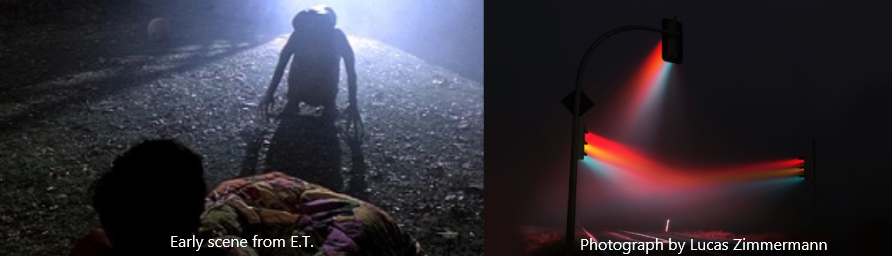

# F20GA Submission

## Inspiration

Having recently watched E.T., I thought about the way the light in one scene created an entire atmosphere all by itself.  Similar to another photograph I'd seen by Lucas Zimmermann, I thought it was an interesting centrepiece to a scene.  I wanted to create models that cast shadows on the ground and diffused light in a thick atmosphere to create a gloomy feel.

The shed at the bottom of my garden often creates this effect at night, so I decided to use it as the basis for my idea.

## Theme

The scene comprises of a lonely garden shed at night, filled with tools and other objects that interact with the light.  It's designed to cast long shadows on the ground and shine beams of light through the cracks in the shed.  The materials used also reflect and obscure light in in different ways.

In the interactive demo, a flashlight is available to use.  Press the F key to toggle the light on or off to better see in the dark.
